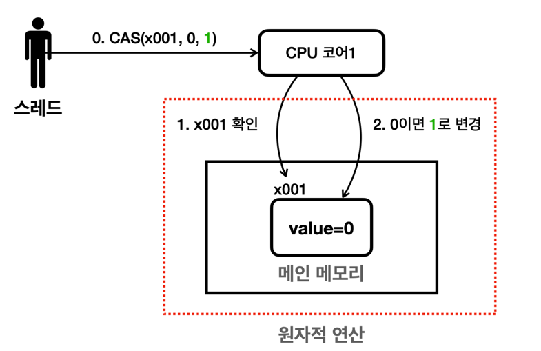

# 락 기반 문제점
- synchronized` , `Lock(ReentrantLock)` 문제점
  - 락은 특정 자원을 보호하기 위해 스레드가 해당 자원에 대한 접근하는 것을 제한한다. 락이 걸려 있는 동안 다른 스레드
    들은 해당 자원에 접근할 수 없고, 락이 해제될 때까지 대기해야 한다.
    또한 락 기반 접근에서는 락을 획득하고 해제하는 데 시간이 소요된다.

# CAS
-  이 방법은 락을 사용하지 않기 때문에 락 프리(lock-free) 기법
- CAS 연산은 락을 완전히 대체하는 것은 아니고, **작은 단위의 일부 영역에 적용**할 수 있다. 기본은 락을 사
  용하고, 특별한 경우에 CAS를 적용


여기서는 `AtomicInteger` 내부에 있는 `value` 값이 0이라면 1로 변경하고 싶다.
`compareAndSet(0, 1)` 을 호출한다. 매개변수의 왼쪽이 기대하는 값, 오른쪽이 변경하는 값이다.
`CAS` 연산은 메모리에 있는 값이 기대하는 값이라면 원하는 값으로 변경한다.
메모리에 있는 `value` 의 값이 0이므로 1로 변경할 수 있다.
그런데 생각해보면 이 명령어는 2개로 나누어진 명령어이다. 따라서 원자적이지 않은 연산처럼 보인다.
1. 먼저 메인 메모리에 있는 값을 확인한다.
2. 해당 값이 기대하는 값(0)이라면 원하는 값(1)으로 변경한다.
   **CPU 하드웨어의 지원**
   CAS 연산은 이렇게 원자적이지 않은 두 개의 연산을 CPU 하드웨어 차원에서 특별하게 하나의 원자적인 연산으로 묶
   어서 제공하는 기능이다. 이것은 소프트웨어가 제공하는 기능이 아니라 하드웨어가 제공하는 기능이다. 대부분의 현대
   CPU들은 CAS 연산을 위한 명령어를 제공한다.
   CPU는 다음 두 과정을 묶어서 하나의 원자적인 명령으로 만들어버린다. 따라서 중간에 다른 스레드가 개입할 수 없다.
1. x001의 값을 확인한다.
2. 읽은 값이 0이면 1로 변경한다.
   CPU는 두 과정을 하나의 원자적인 명령으로 만들기 위해 1번과 2번 사이에 다른 스레드가 `x001` 의 값을 변경하지 못
   하게 막는다. 참고로 1번과 2번 사이의 시간은 CPU 입장에서 보면 아주 잠깐 찰나의 순간이다. 그래서 성능에 큰 영향
   을 끼치지 않는다. CPU가 1초에 얼마나 많은 연산을 수행하는지 생각해보면 이해가 될 것이다.

## 코드로 이해하기
```java
static int incrementAndGet(AtomicInteger atomicInteger) {
    int getValue;
    boolean result;
    do {
        getValue = atomicInteger.get(); // 읽었을 때 0
        log("getValue=" + getValue);
        result = atomicInteger.compareAndSet(getValue, getValue + 1);
        log("result=" + result);

    } while (!result);
    return getValue + 1;
}
```

- result 가 false면 계속 do 문을 실행한다
- atomicInteger.get()로 값을 가져온다
- compareAndSet()로 해당 값을 가져와 (읽은 값)<=> (해당 값 + 1) 비교한다.
- 같다면 (해당 값 + 1) 한다.
- result = true가 된다. (실패면 다시 값을 읽어 반복한다)